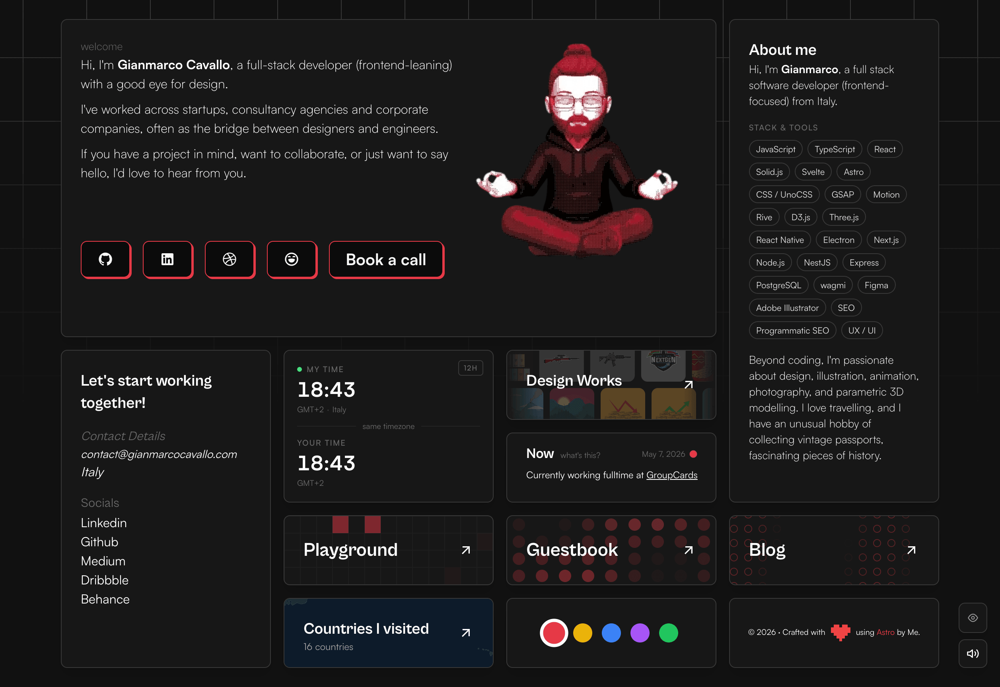

# ⚡️astro-bento-portfolio

## A personal portfolio website made using `Astro`.



To view a demo example, **[click here](https://sparkly-speculoos-0c9197.netlify.app/)**

or my portfolio **[click here](https://gianmarco.xyz/)**

## Features

- Modern and Minimal bento-like, sleek UI Design
- All in one page (almost)
- Fully Responsive
- Performances and SEO optimizations
- Ready to be deployed on [Netlify](https://www.netlify.com/)
- Blog
- RSS support (your-domain/rss.xml)

## Tech Stack

- [Astro](https://astro.build)
- [unocss](https://unocss.dev/)
- [motion](https://motion.dev/)

# Steps ▶️

```bash
# Clone this repository
$ git clone https://github.com/Ladvace/astro-bento-portfolio
```

```bash
# Go into the repository
$ cd astro-bento-grid-portfolio
```

```bash
# Install dependencies
$ npm install
```

```bash
# Start the project in development
$ npm run dev
```

# Deploy on Netlify 🚀

Deploying your website on Netlify it's optional but I reccomand it in order to deploy it faster and easly.

You just need to fork this repo and linking it to your Netlify account.

or

[](https://app.netlify.com/start/deploy?repository=https://github.com/Ladvace/astro-bento-portfolio)

## Authors ❤️

- Gianmarco - https://github.com/Ladvace
