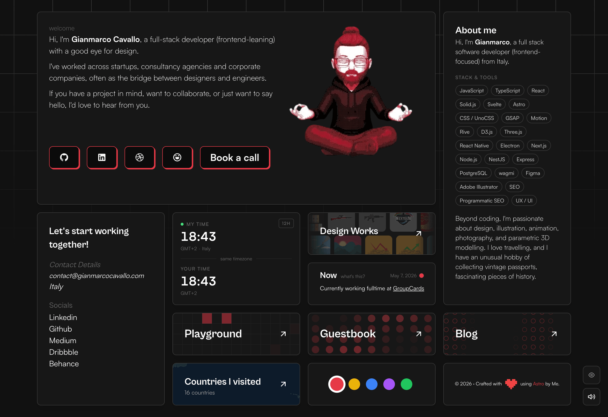

# ⚡️ astro-bento-portfolio

A modern, bento-style personal portfolio built with **[Astro](https://astro.build)**.



**Live:** [gianmarcocavallo.com](https://gianmarcocavallo.com/)

---

## Features

- 🧩 **Bento-grid layout** — sleek, minimal, single-page-first design
- 🎨 **Switchable UI themes** — glass, sharp, neon and paper styles, with color variants
- 📱 **Fully responsive**
- ✍️ **Blog** with Markdown content, reading-time estimates and **RSS** (`/rss.xml`)
- 💬 **Guestbook** — visitors can leave messages and reactions (backed by libSQL)
- 🌍 **Interactive 3D globe** and a **travel map** of visited countries
- 🧪 **Playground** — a collection of animation/interaction experiments (GSAP morphs, Rive, WebGL-ish effects, scroll animations, and more)
- 🔊 Subtle **UI sound effects** (toggleable)
- 🚀 **Performance & SEO optimized** — sitemap, robots.txt, Open Graph tags
- ☁️ Ready to deploy on **[Netlify](https://www.netlify.com/)** (SSR)

## Tech Stack

| Area       | Tools                                                                                                                             |
| ---------- | --------------------------------------------------------------------------------------------------------------------------------- |
| Framework  | [Astro](https://astro.build) (SSR)                                                                                                |
| Styling    | [UnoCSS](https://unocss.dev/)                                                                                                     |
| UI islands | [SolidJS](https://www.solidjs.com/), [Svelte](https://svelte.dev/)                                                                |
| Animation  | [Motion](https://motion.dev/), [GSAP](https://gsap.com/), [Lenis](https://lenis.darkroom.engineering/), [Rive](https://rive.app/) |
| Dataviz    | [D3](https://d3js.org/) (globe)                                                                                                   |
| Database   | [Drizzle ORM](https://orm.drizzle.team/) on [libSQL / Turso](https://turso.tech/) (guestbook)                                     |
| Hosting    | [Netlify adapter](https://docs.astro.build/en/guides/integrations-guide/netlify/)                                                 |

## Prerequisites

- **Node.js** `24.13.0` (see [`.nvmrc`](.nvmrc) — run `nvm use`)
- **[pnpm](https://pnpm.io/)** (this repo uses `pnpm@10`)

## Getting Started

```bash
# 1. Clone
git clone https://github.com/Ladvace/astro-bento-portfolio
cd astro-bento-portfolio

# 2. Install dependencies
pnpm install

# 3. Start the dev server (http://localhost:4321)
pnpm dev
```

## Make It Yours

Run the interactive setup to personalize the site:

```bash
pnpm site-setup
```

This walks you through your name, links, email, location/timezone and more, updating `src/site-config.ts` and writing `SITE_URL` to `.env`. Restart the dev server afterwards.

A few things the script **doesn't** cover:

- Swap the avatar/memoji images — replace `src/assets/me-dither*.webp` with your own.
- Remove (or replace with your own ID) the **Umami analytics** script tag in `src/layouts/BasicLayout.astro`.

## Scripts

| Command           | Description                          |
| ----------------- | ------------------------------------ |
| `pnpm dev`        | Start the dev server                 |
| `pnpm build`      | Production build                     |
| `pnpm preview`    | Preview the production build locally |
| `pnpm check`      | Type-check with `astro check`        |
| `pnpm eslint`     | Lint `src`                           |
| `pnpm format`     | Format with Prettier                 |
| `pnpm site-setup` | Interactive personalization          |

## Database (Guestbook)

The guestbook uses [Drizzle ORM](https://orm.drizzle.team/) over a remote **libSQL** database (e.g. [Turso](https://turso.tech/)). Provide your database credentials as environment variables:

```bash
TURSO_DATABASE_URL=libsql://<your-database>.turso.io
TURSO_AUTH_TOKEN=<your-auth-token>
```

Then create the table:

```sql
CREATE TABLE "Guestbook" (
  "id" integer PRIMARY KEY,
  "name" text NOT NULL,
  "message" text NOT NULL,
  "website" text,
  "parentId" integer,
  "heartCount" integer,
  "createdAt" text NOT NULL
);
```

The client and schema live in `src/lib/db.ts`. `createdAt` is stored as an ISO 8601 string.

> These variables must be set in your deploy environment. If you don't need the guestbook, delete `src/lib/db.ts`, `src/pages/guestbook.astro` and the `src/pages/api/guestbook.ts` / `reactions.ts` routes.

## Deploy on Netlify 🚀

Deploying on Netlify is optional but recommended for the quickest setup. Fork this repo and link it to your Netlify account — or use the one-click button below. Remember to set the database environment variables (above) in your Netlify site settings.

[](https://app.netlify.com/start/deploy?repository=https://github.com/Ladvace/astro-bento-portfolio)

## License

Released under the [MIT License](LICENSE).

## Author

**Gianmarco Cavallo** — [github.com/Ladvace](https://github.com/Ladvace) · [gianmarcocavallo.com](https://gianmarcocavallo.com/)
